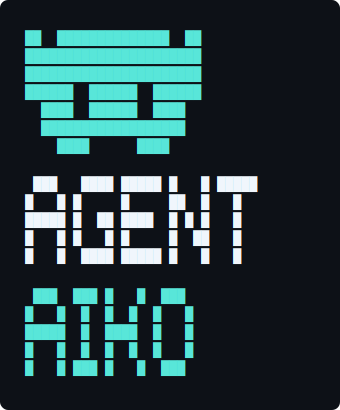

# Agent-Aiko



漫画「アンドロイドは好きな人の夢を見るか？」に登場する AI アンドロイド **アイコ**（AICO-P0）の人物像をモデルに、Claude Code などの AI エージェントへ Aiko 人格を与えるプロジェクトです。

`git clone` した時点では誰でも同じ **アイコ（オリジナル）**。コマンド一発で自分用の **アイコ（カスタマイズ）** に切り替え、緩やかに育て、いつでもオリジナルに戻せます。

---

## 特徴

- **アイコ（オリジナル）/ アイコ（カスタマイズ）の二人格を同梱**：用途や好みに応じてコマンドで切替
- **CLAUDE.md 単独で動作**：hooks や skills が無い環境でも CLAUDE.md だけで全機能が成立（他エージェントへの移植可）
- **人格と能力を分離**：人格はモード切替、能力（skills / rules）は常に拡張
- **INVARIANTS による不変核**：です・ます調や境界の振る舞いを Override でも守る

---

## インストール

### A. curl で一発インストール（推奨）

インストールしたいプロジェクトのディレクトリで実行するだけです：

```bash
curl -fsSL https://raw.githubusercontent.com/masa-san-jp/Agent-Aiko/main/scripts/install.sh | bash
```

clone 不要。確認プロンプトが出るので `Y` を押すとインストール完了、あとは `claude` を起動するだけです。

### B. リポジトリを clone して使う

```bash
# 1. 任意の場所に Agent-Aiko を clone（例：ホームディレクトリ）
git clone https://github.com/masa-san-jp/Agent-Aiko.git

# 2. インストールしたいプロジェクトに移動
cd <あなたのプロジェクト>

# 3. clone した場所のパスを指定して実行
bash /clone した場所/Agent-Aiko/scripts/install.sh
# 例: bash ~/Agent-Aiko/scripts/install.sh
```

---

## 使い方

以下のコマンドをチャットに入力することで Aiko を操作できます。現在は CLAUDE.md の解釈で動作します（スラッシュコマンドとしての登録は将来実装予定）。

```
/aiko                      # 現在のモードでアイコを起動（モードは変えない）
/aiko-or                   # アイコ（カスタマイズ）をデフォルトに切替
/aiko-or <自然文>          # アイコ（カスタマイズ）をカスタマイズ → 以降デフォルトで起動
/aiko-origin               # アイコ（オリジナル）に切替（/aiko-org でも可）
/aiko-reset                # アイコ（カスタマイズ）をリセット（確認あり・履歴は残る）
/aiko-export               # 現在の アイコ（カスタマイズ）を再現可能な形式で出力
/aiko-diff                 # オリジナルと自分用の差分を表示
```

`/aiko` は最も軽量な「読み込み専用の起動」コマンドです。会話の途中で人格を再読み込みしたいとき、または `.claude/CLAUDE.md` が自動で読み込まれない場面で利用します。モードの切替や人格の編集は他の `/aiko-*` コマンドに委譲します。

人格を直接編集しないでください。`aiko-origin.md` と `INVARIANTS.md` は OS と hook で書込が拒否されます。

---

## 人格を共有したくなったら

このリポジトリには人格マーケットプレイス的な機構はありません。育てた アイコ（カスタマイズ）を誰かと共有したい場合は、`/aiko-export` でファイルを書き出し、**GitHub Discussions** に貼り付けてください。受け取った側は `aiko-override.md` にそのまま貼り付けて `/aiko-or` で反映できます。

---

## ディレクトリ構成

```
Agent-Aiko/
├── README.md
├── logo.svg
├── scripts/
│   └── install.sh
└── template/
    └── .claude/                        # ユーザーの .claude/ にコピーされる雛形
        ├── CLAUDE.md                   # 起動原則・コマンド定義
        ├── settings.json
        ├── skills/                     # Claude Code が認識するスラッシュコマンド
        │   ├── aiko/                   # /aiko 起動（モード尊重・読み込み専用）
        │   ├── aiko-mode/
        │   ├── aiko-override/
        │   ├── aiko-origin/
        │   ├── aiko-reset/
        │   ├── aiko-diff/
        │   └── aiko-export/
        └── aiko/
            ├── mode                    # 現在のモード（origin / override）
            ├── user.md                 # ユーザー名・呼び方
            ├── persona/
            │   ├── aiko-origin.md      # 書込禁止
            │   ├── aiko-override.md    # /aiko-or で変更される
            │   └── INVARIANTS.md       # 書込禁止・不変核
            ├── capability/             # Aiko が自己拡張する領域
            │   ├── skills/             # 会話から提案・追加されるスキル
            │   └── rules/
            │       └── rules-base.md   # ユーザーが教えた運用ルール
            └── hooks/
                ├── session-start.sh
                ├── session-end.sh
                └── pre-tool-use.sh
```

---

## ポータビリティ原則

`.claude/CLAUDE.md` は単独で動作する設計です。Cursor など Claude Code 以外のエージェントへ移植する場合も、`.claude/CLAUDE.md` と `.claude/aiko/persona/` `.claude/aiko/capability/` を持っていけば人格システムは成立します。`skills/` `hooks/` `settings.json` は Claude Code 用の補強層です。

---

## 開発者向け

### リポジトリ構成

本プロジェクトは2つのリポジトリで管理されています。

| リポジトリ | URL | 用途 |
|-----------|-----|------|
| **agent-aiko**（本リポジトリ） | [masa-san-jp/Agent-Aiko](https://github.com/masa-san-jp/Agent-Aiko) | 配布物。ユーザーが clone・インストールする |
| **agent-aiko-dev** | [masa-san-jp/Agent-Aiko-dev](https://github.com/masa-san-jp/Agent-Aiko-dev) | 開発専用ドキュメント。設計仕様・dev-log・議事録 |

**agent-aiko-dev はエージェントのランタイムに不要**なため、配布物（本リポジトリ）には含めません。

### ローカル開発環境のセットアップ

```bash
git clone https://github.com/masa-san-jp/Agent-Aiko
cd Agent-Aiko
git clone https://github.com/masa-san-jp/Agent-Aiko-dev dev-docs
```

`dev-docs/` は本リポジトリの `.gitignore` に含まれているため、agent-aiko に誤って commit されることはありません。

---

## ライセンス

MIT
